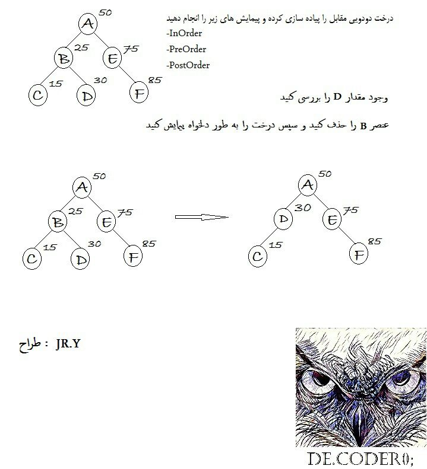
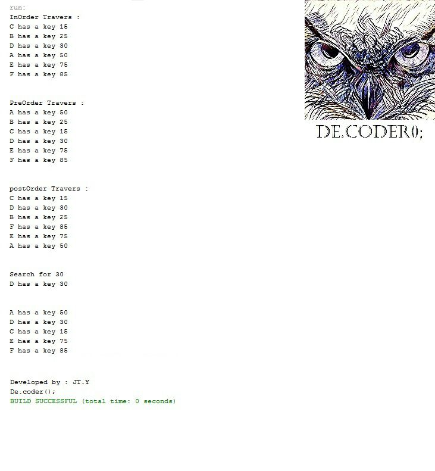

# Binary-Tree-In-Pre-and-Post-order-Traverse

My 5th project in "Data Structures and Algorithms" coures when I was in 3rd semester of my bachelor's at IAUSTB. This program gives a binary tree as an input, and make a preorder, postorder, and inorder traverse to find an element by it's key.

## Question
|  | 
|:--:| 
| *In This question, we are given by a binary tree and wants to find 'D' elements on it.*

## Output
|  | 
|:--:| 
| *Output*

