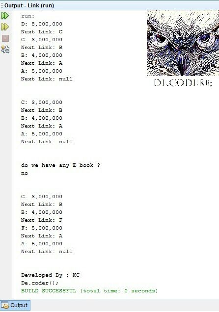

# Book-Store-Linked-List-with-Java

My first project in "Data Structures and Algorithms" coures when I was in 3rd semester of my bachelor's at IAUSTB.
This Program is used to manage the books of a bookstore with Linked List data type.
|  | 
|:--:| 
| *Linked List in Java* |
