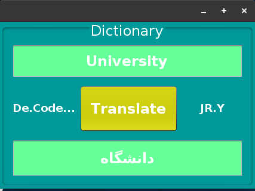

# Dictionary-with-GUI-Swing

My 7th project was in the "Data Structures and Algorithms" course when I was in the 3rd semester of my bachelor's at IAUSTB. This program stores a trie tree as a dictionary of words. It gives an English word as input and results in Persian by traversing the trie tree.

## Output
|  | 
|:--:| 
| *Output*

