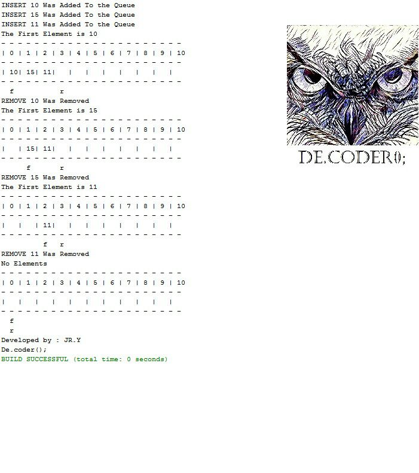

# FIFO-Queue-Array-with-Java

My Second project was in "Data Structures and Algorithms" courses when I was in the 3rd semester of my bachelor's at IAUSTB. This Program is used to manage the input numbers with the Array Queue data type.
|  | 
|:--:| 
| *Array Queue in Java* |

