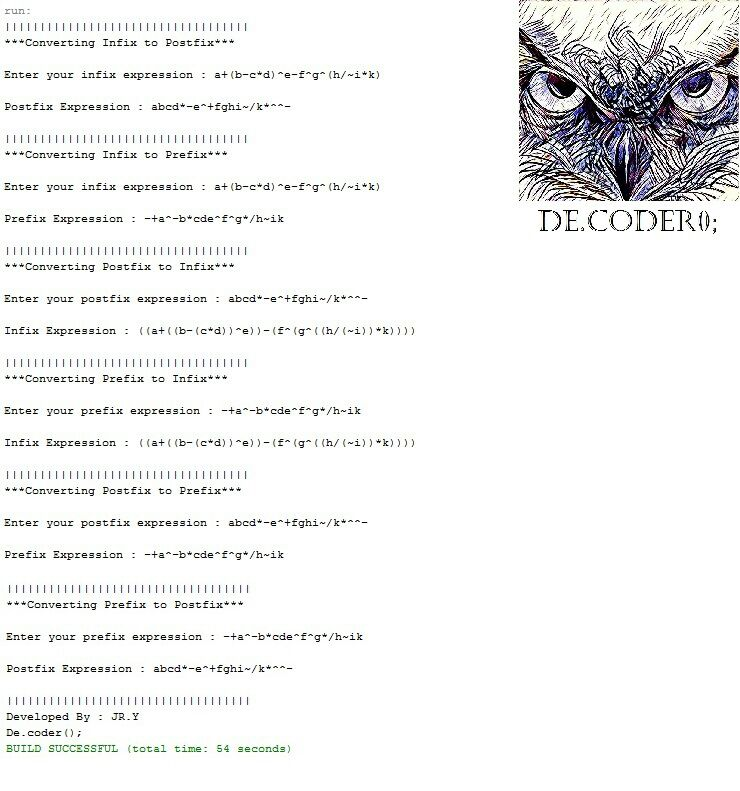

# Infix-Postfix-and-Prefix-Conversion-with-Stack

My 6th project was in "Data Structures and Algorithms" courses when I was in the 3rd semester of my bachelor's at IAUSTB. This program gives an infix, prefix, or postfix arithmetic expression as an input, and converts it to any mentioned desired representation.

|  | 
|:--:| 
| *a sample output*
