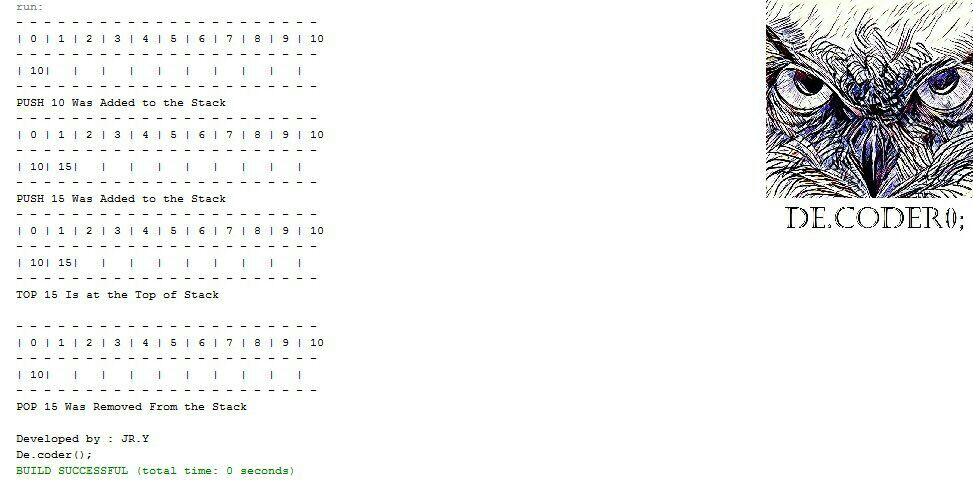

# LIFO-Stack-Array-with-Java

My Third project was in "Data Structures and Algorithms" courses when I was in 3rd semester of my bachelor's at IAUSTB. This Program is used to manage the input numbers with the Array Stack data type.
|  | 
|:--:| 
| *Array Stack in Java* |

