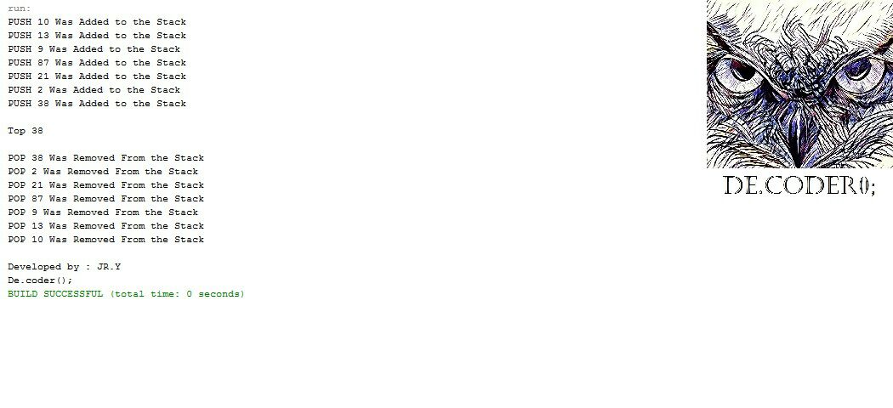

# LIFO-Stack-LinkedList-with-Java

My 4th project was in "Data Structures and Algorithms" courses when I was in the 3rd semester of my bachelor's at IAUSTB. This Program is used to manage the input numbers with LinkedList Stack data type.

|  | 
|:--:| 
| *LinkedList Stack in Java* |

